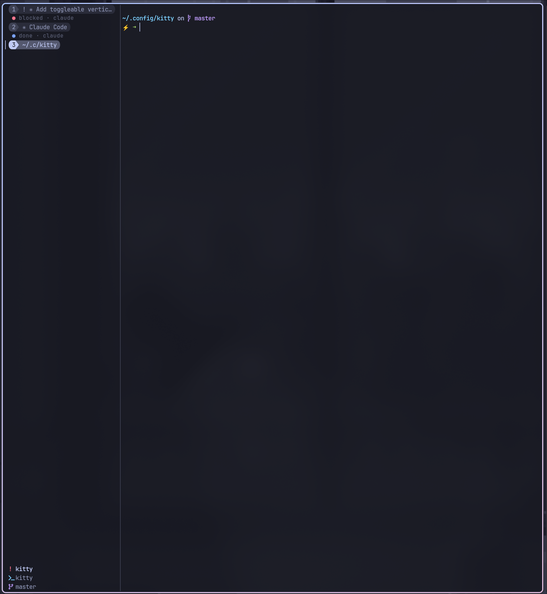

# purrmux

A tmux-ish kitty config — a `ctrl+g` leader driving modal pane/tab/scroll/session navigation, zoxide-backed session management, fzf pane and agent pickers, lazygit/lazydocker overlays, and a custom tab bar that doubles as the mode cheatsheet.



## At a glance

| Tier | Keys | What lives there |
| --- | --- | --- |
| **Leader** | `ctrl+g` | Everything infrequent — modes (`p` pane, `t` tab, `s` scroll, `o` session, `a` appearance, `l` lock) and tools (`g` lazygit, `d` lazydocker, `b` btop, `/` help) |
| **Quick** | `alt+h/j/k/l`, `alt+[`, `alt+]` | The hot path — pane focus and session cycling |
| **kitty** | `ctrl+shift+…` | New tab and window, tab switching |

Three tiers, arranged so kitty takes as little as possible from the programs running inside it: one key from your shell and editor, plus six on the hot path. Full cheatsheet in [`KEYBINDS.md`](KEYBINDS.md), or press `ctrl+g` `/` while running.

## Contents

- [What changed](#what-changed)
- [Prerequisites](#prerequisites)
- [Install](#install)
- [Launch it with `--single-instance`](#launch-it-with---single-instance)
- [Platform support](#platform-support)
- [Customizing without forking](#customizing-without-forking)
- [Vertical tab bar (sidebar)](#vertical-tab-bar-sidebar)
- [Agent attention hooks](#agent-attention-hooks)
- [Security note](#security-note)

## What changed

The keybinds were restructured in full. A single `ctrl+g` leader replaces the old `alt+p` / `alt+t` / `alt+s` / `alt+o` / `alt+g` mode keys and the `ctrl+a>…` chords, so kitty takes one key from the programs inside it rather than eleven — and `ctrl+a` goes back to being beginning-of-line. `alt+h/j/k/l` and `alt+[` / `alt+]` are unchanged.

One behaviour change is worth calling out, because it is a fix rather than a rename: in pane mode `h/j/k/l` now focus and `H/J/K/L` now move. They used to collide. kitty parses a bare `H` identically to `h`, and the later binding wins, so pane mode had been moving panes on `h` with focus unreachable. `g`/`G` in scroll mode had the same problem.

## Prerequisites

**Required**

| Tool | Why |
| --- | --- |
| [kitty](https://sw.kovidgoyal.net/kitty/) 0.48+ | The vertical tab bar (`tab_bar_edge left`) is the default here; on older versions see the `override.conf` note under [Vertical tab bar](#vertical-tab-bar-sidebar), which also needs `globinclude` and the `KITTY_OS` variable |
| Python 3 | Ships with both distros; used by the tab bar and the session, tab and tool scripts |
| [fish](https://fishshell.com/) | Set as `shell` in `kitty.conf`; change the line (or use `override.conf`) if you use zsh or bash |
| [JetBrainsMono Nerd Font](https://www.nerdfonts.com/) | Tab-bar icons and powerline glyphs |

**Used by the keybinds and overlays**

| Tool | Why |
| --- | --- |
| [fzf](https://github.com/junegunn/fzf) 0.58+ | Session picker, pane picker, agent picker and overview. 0.58 is where the `--list-border` / `--input-border` / `--preview-border` options the pickers use landed (tested with 0.74) |
| [zoxide](https://github.com/ajeetdsouza/zoxide) | Source of session candidates |
| [bat](https://github.com/sharkdp/bat) + `less` | Render the `ctrl+g` `/` keybinds tab |

**Optional**

| Tool | Reached by |
| --- | --- |
| [lazygit](https://github.com/jesseduffield/lazygit) | `ctrl+g` `g` |
| [lazydocker](https://github.com/jesseduffield/lazydocker) | `ctrl+g` `d` |
| [btop](https://github.com/aristocratos/btop) | `ctrl+g` `b` |
| `nvim` (or any `$EDITOR`) | Editing session files via the session picker |

## Install

```sh
git clone <this-repo> ~/.config/kitty
~/.config/kitty/setup.sh
```

`setup.sh` seeds `override.conf`, the gitignored file where your own settings go — see [Customizing without forking](#customizing-without-forking). It's safe to rerun: an existing `override.conf` is never overwritten. Skipping it costs you nothing but that starting point, since `globinclude` ignores the file when it's absent.

The `startup_session` and all script paths assume `~/.config/kitty`; if you clone elsewhere you'll need to adjust `kitty.conf` and the `keybinds.conf` launch lines — `setup.sh` warns you when the checkout isn't there.

## Launch it with `--single-instance`

Sessions here are OS windows inside **one** kitty process, and every cross-session feature drives that process through its single remote-control socket (`kitten @ ls`, `focus-window`, …). So launch kitty as:

```sh
kitty --single-instance
```

Put the flag wherever you launch from — a compositor keybind, a `.desktop` file's `Exec=`, or a shell alias. Without it every `kitty` invocation is a separate process with its own socket, and these quietly narrow to "only sees its own window":

- `alt+]` / `alt+[` — session cycling; `cycle-session.py` enumerates the tabs on one socket, so other instances' sessions aren't in the rotation
- `ctrl+g o k` with `--target=window` — the session opens in the instance you invoked it from; separate processes each accumulate their own unrelated set
- `ctrl+g o a` and `ctrl+g o o` — "every agent across all sessions" means every agent in *this* instance
- the quake dropdown's `--main-listen-on auto` — `discover_main_listen_on()` takes the first socket it finds and warns `multiple kitty instances found`; export `KITTY_MAIN_LISTEN_ON` to pin one if you really do run several (or give each pool its own `--instance-group NAME`)

### Making it the default on macOS

There is no `kitty.conf` option for `--single-instance`; it is command-line only. macOS won't let you attach arguments to a GUI app either, so kitty reads them from a file instead — which this repo ships as [`macos-launch-services-cmdline`](macos-launch-services-cmdline):

```
--single-instance
```

kitty reads `<kitty config dir>/macos-launch-services-cmdline` "when it is launched from the GUI, i.e. by clicking the kitty application icon or using `open -a kitty`" ([FAQ](https://sw.kovidgoyal.net/kitty/faq/#how-do-i-specify-command-line-options-for-kitty-on-macos)). Since the file lives next to `kitty.conf`, cloning this repo to `~/.config/kitty` puts it in place already — nothing to configure. Two things to know about it:

- It's parsed as shell syntax, so it takes no comments — a `#` would be passed to kitty as an argument. Keep it to flags.
- It's ignored on Linux and by direct binary invocations, so it's harmless to keep in a shared config.

That covers the Dock, Finder, Spotlight, Login Items (System Settings → General → Login Items, for launching at boot) and `open -a kitty`. What it does **not** cover is calling the binary directly — `kitty` on your `PATH`, or `/Applications/kitty.app/Contents/MacOS/kitty`. For those, either invoke `open -a kitty` instead (it picks the flag up from the file), or pass the flag yourself; if you launch from a shell often, `alias kitty='kitty --single-instance'` in `~/.config/fish/config.fish` covers it, and a wrapper script earlier on `PATH` covers hotkey tools like skhd or Raycast that don't read your shell config.

The flip side of one instance on macOS: `cmd+q` quits it, taking every session with it, and `cmd+w` closes windows within it. Worth knowing before reaching for either out of habit.

Getting the flag onto the *first* instance is the part that matters: the single-instance socket is only created by an instance that itself started with `--single-instance`, so a GUI-launched kitty without it is invisible to a later `kitty --single-instance` and you end up with two pools anyway. Leave `macos_quit_when_last_window_closed` at its default (`no`) so the instance outlives its last window and subsequent launches reattach.

## Platform support

Works on Linux and macOS. OS-specific bits live in `os-linux.conf` and `os-macos.conf`, auto-selected via:

```
include os-${KITTY_OS}.conf
```

Currently split that way:

- **`listen_on`** — Linux uses an abstract unix socket (`unix:@kitty-…`); macOS uses a filesystem socket under `/tmp`.
- **`bell_path`** — Linux points at the freedesktop stereo bell; macOS falls back to kitty's default bell (add your own `bell_path /System/Library/Sounds/Glass.aiff` in `os-macos.conf` if desired).
- **`macos_option_as_alt yes`** (macOS) — the quick tier is Alt-based (`alt+hjkl`, `alt+[` / `alt+]`), and kitty's default `no` makes Option produce Unicode input instead, which would leave those six dead. The trade is Option-composed characters (`é`, `ü`) — put `macos_option_as_alt left` in `override.conf` to keep right-Option for input. The `ctrl+g` leader and everything under it are unaffected either way.
- **`cmd+t` / `cmd+enter`** (macOS) — kitty defines these as plain `new_tab` / `new_window`, skipping the cwd-aware overrides `keybinds.conf` puts on `ctrl+shift+t` / `ctrl+shift+enter`. `os-macos.conf` repoints them at `new_tab_with_cwd` / `new_window_with_cwd` so new tabs and windows join the current session whichever key you reach for.
- **scrollback overlays** — `kitty_mod+i` (nvim pager) and `kitty_mod+m` (scrollback as markdown) live in `os-linux.conf` only. `kitty_mod+i` copies over to `os-macos.conf` as-is; `kitty_mod+m` does not, because `mktemp --suffix=.md` is GNU-only and BSD `mktemp` has no `--suffix`. Use `f=$(mktemp -d)/scrollback.md` there instead — the extension is what makes nvim's markdown rendering fire, so it can't just be dropped.

Everything else in [`KEYBINDS.md`](KEYBINDS.md) is identical across the two: `kitty_mod` is `ctrl+shift` on both platforms, and the `ctrl+g` leader and its in-mode keys are plain characters.

## Customizing without forking

`kitty.conf` ends with:

```
globinclude override.conf
```

`override.conf` sits next to `kitty.conf` and takes any directives you want to change. Because it's included last, it beats everything above it. `setup.sh` creates it for you (with just a comment header pointing back here); you can also write it by hand — the glob matches nothing when the file is absent, so there's no error either way.

It's in `.gitignore`, which is the point: your settings live in the working tree without ever showing up in `git status` or clashing with a `git pull`. Reload after editing with `ctrl+shift+f5` — no restart.

The knobs most worth knowing about:

```
# override.conf

# use zsh instead of fish (kitty.conf sets fish)
shell zsh

# dial opacity back
background_opacity 0.9

# start with the horizontal tab bar instead of the sidebar. These are the same
# three values ctrl+g a v sends at runtime, and also the fix on kitty older than
# 0.48, where `left` is not a valid tab_bar_edge
tab_bar_edge bottom
tab_bar_align center
tab_title_max_length 0

# macOS: keep right-Option free for composing accented characters (é, ü) at the
# cost of the right side no longer acting as Alt for the leader keys
macos_option_as_alt left

# rebind the keybinds overlay
map ctrl+shift+h launch --type=tab --tab-title="keybinds" sh -c 'bat --color=always --style=plain --language=md "$HOME/.config/kitty/KEYBINDS.md" | less -R'
```

`allow_remote_control no` belongs here too if you want it — read the [Security note](#security-note) first, since it takes the session picker, pane picker, agent overview and tool overlays with it.

## Vertical tab bar (sidebar)

kitty 0.48 can put the tab bar on the left or right edge, and this config uses that by default: `kitty.conf` sets `tab_bar_edge left` with `tab_title_max_length 26` and `tab_bar_align start`. `ctrl+g a v` switches to the horizontal bar and back at runtime — no restart, no config edit:

```sh
tab_bar/toggle-edge.py [toggle|sidebar|horizontal|left|right|top|bottom|status]
```

Both directions send their own overrides rather than one of them falling back to `kitty.conf`, so the toggle behaves the same whichever edge is configured — the config only decides how kitty starts. Sidebar means `left` + 26 title cells + top-aligned tabs; horizontal means `bottom` + unlimited titles + centred tabs. Adjust either set at the top of `tab_bar/toggle-edge.py`.

There is no remote-control command for setting an option, so the script reloads the config with `tab_bar_edge`/`tab_title_max_length`/`tab_bar_align` overrides (`kitten @ load-config -o …`) and reloads without them to go back. Being a config reload, it also resets runtime-only tweaks such as `set_background_opacity` to their configured values. State lives in `$XDG_RUNTIME_DIR/kitty-tab-bar-edge-*`, per kitty instance, falling back to `/tmp` when that variable is unset — which is the normal case on macOS.

The custom tab bar draws a different layout in sidebar mode (`tab_bar/vertical.py`):

- **Tabs** as one flat row each from the top — a coloured dot, the title, and a muted second line. The active tab is a filled band running edge to edge rather than a pill, which is what keeps a column of tabs from reading as a stack of buttons next to a TUI. The band is the only active marker: no gutter glyph, so nothing indents the titles. `VERTICAL_TAB_STYLE = "chip"` brings back the powerline pills the horizontal bar uses, `VERTICAL_ACTIVE_MARKER` and all.
- **The divider** between sidebar and panes is a change of background, not a drawn line. That boundary is the cleanest divider there is — it costs no column and cannot cut through a highlight — so the band runs the sidebar's full width. kitty paints the bar in `tab_bar_background` where a theme sets one; where a theme doesn't, `VERTICAL_SURFACE` derives one and writes it to the tab bar screen itself (`apply_bar_surface`). Only if that is off does the full-height `VERTICAL_SEPARATOR` rule come back, since kitty has no option for a tab bar border — and then the band stops where the rule starts, one column short of the edge, so the rule stays a divider rather than a line down the middle of a highlight. `VERTICAL_SEPARATOR_AUTO = False` draws the rule regardless.

  Writing the background costs nothing because kitty erases the bar screen before the first tab is drawn and resolves every default-background cell at render time — so the erased rows, the gaps between tabs and the footer all pick it up, with no cell painted and no change to the drawing code. kitty rewrites the value on each reload and resize, so it goes back on every frame.

  The derived colour blends the background toward the theme's own **foreground**, which lightens a dark theme and darkens a light one, and keeps the theme's hue instead of washing it toward grey. Direction and distance come from the themes that ship a `tab_bar_background`: 46 of the 60 dark ones that differ go lighter, every light one goes darker, and the median gap is 0.05 in luminance, which is what `_SURFACE_STEP` targets. Sidebar only — a horizontal bar sits along one edge with no long boundary to divide, so tinting it would be a look rather than a fix.

  Everything the bar draws is blended from *that* surface rather than from `background` (`bar_background`), which is what keeps the active band visible on top of it. Measured from the window background instead, the band and the sidebar land 0.012 apart in luminance on Tokyo Night and the highlight all but vanishes; measured from the surface it is 0.063 and reads clearly.
- **A second line** under each tab, on the spare row kitty hands out whenever there are at most `lines / 2` tabs: what the agent is doing (`working · claude`). The dot carries the agent's status colour, so a blocked agent is visible from across the screen without reading a word. Tabs with no agent leave the row empty, which is the space between one tab and the next.

The dot is the app's icon where the tab is running something we have an icon for, an agent's status dot where it's running an agent, and a folder for a shell — whose title is a path anyway. `VERTICAL_TAB_BULLET` covers everything else.
- **A footer** carrying what the horizontal bar keeps in its side sections — agent attention, session, git branch, plus the keyboard mode (including zoom) and its hints. Drawn flat rather than as powerline chips, since stacked caps read as chunky pills in a narrow column, with each row's icon coloured from the theme palette. It's dropped entirely when the tabs need the rows.

There are no section headers between groups of tabs. kitty places each tab at `start_row + i * tab_line_height` and builds the click map from those same rows, so a header row drawn between two tabs would shift every tab below it out of its own hit box and clicking the sidebar would focus the wrong tab.

The branch is the *session's*, read from the directory its session file `cd`s to (`~/.local/share/kitty-sessions/<name>.kitty-session`, cached on that file's mtime) rather than from whatever window is focused. A branch belongs to the project, so it should not change when you cd, and a session whose tabs sit in two different repos should not report whichever one you last looked at. Sessions with no file — the startup session, or one opened by hand — fall back to the focused window's cwd, which is all there is.

Those rows are in two groups, split by what they answer: what is happening now — the keyboard mode with its hints, and any agent waiting on you — then where you are, the branch with the session under it. One blank row between them, none inside, so the block reads as two things rather than one wall of text. The session name sits at the bottom, flush against the last line, and is marked as the anchor by weight — bold at full brightness — rather than by size. `VERTICAL_SESSION_SCALE` will scale it, but there is no gentle setting: kitty's text sizing protocol can shrink a glyph inside its cell and never grow it past one, so anything above 1 claims a second cell in both directions, and only whole multiples fill what they claim. 1.5× reads as letter-spaced with an empty sliver under it; 2× is tight but twice the size. Where it is used, the extra row is reserved rather than left spare, so nothing trims it out from under the name. A group whose rows all have nothing to say disappears with its blank row, and when the sidebar runs short the blank rows are the first thing shed, bottom-most first, so spacing never costs a hint. `VERTICAL_FOOTER_SPACING` sets the gap; `VERTICAL_FOOTER_BOTTOM_PAD` is `0` so the session name ends the column flush against the last line.

### The keyboard mode row

A mode change refreshes the tab bar and nothing else (kitty passes `refresh_active_tab_bar` as its only mode-change callback), so the footer is the one surface that can react to a mode while it's active. A which-key style popup would render fine — kitty's mapping layer takes keys before any window, so an overlay wouldn't steal them — but nothing would ever tell it to close.

So the mode row does both jobs. Idle it shows `LEADER_HINT` (`^g`) rather than the word "normal", which is the only thing advertising the leader; in a mode it shows the mode's name and its keys.

`MODE_HINT_STYLE` picks how those keys are drawn, from one grouped table in `tab_bar/config.py`:

```
"labels" (default)        "keys"
 p pane        t tab       modes  p t s o a l
 s scroll      o session    tools  g d b /
 a appearance  l lock
 g git         d docker
 b btop        / help
```

`"labels"` spends five rows on the leader and teaches, falling back to one pair per row when the sidebar is too narrow to split; `"keys"` fits it in two and reads as a reminder once the letters are familiar. When rows run short the hints are shed from the end, and the last one becomes `…+3 more` rather than disappearing quietly.

Knobs at the top of `tab_bar/config.py`: `MODE_HINT_STYLE`, `LEADER_HINT`, `SHOW_LEADER_HINTS` (list the leader's keys while idle — horizontal bar only), `VERTICAL_TAB_STYLE`, `VERTICAL_TAB_BULLET`, `VERTICAL_ACTIVE_MARKER`, `VERTICAL_SEPARATOR`, `VERTICAL_SEPARATOR_AUTO`, `VERTICAL_SURFACE`, `VERTICAL_SHOW_STATUS` (off hides the whole footer, leader row included), `VERTICAL_SHOW_AGENT_STATUS`, `VERTICAL_SHOW_TAB_BRANCH`, `VERTICAL_FOOTER_STYLE`, `VERTICAL_FOOTER_ICON_COLORS`, `VERTICAL_FOOTER_SPACING`, `VERTICAL_FOOTER_BOTTOM_PAD`, `VERTICAL_SESSION_SCALE`, and `VERTICAL_SECONDARY_TEXT_SCALE` (font size of the status and hint rows, via kitty's text sizing protocol — chips can't scale, their borders are glyphs). Sidebar side and width live in `tab_bar/toggle-edge.py` (`SIDEBAR_EDGE`, `SIDEBAR_CELLS`).

To start with the horizontal bar instead, put `tab_bar_edge bottom`, `tab_bar_align center` and `tab_title_max_length 0` in `override.conf` — the same values the toggle sends. That's also the fix on kitty older than 0.48, where `left` is not a valid edge.

## Agent attention hooks

The custom tab bar and `ctrl+g o a` attention picker can show agent windows that need attention.

Install the bundled attention hooks/plugins:

```sh
~/.config/kitty/hooks/install-attention-hooks.sh
```

The installer is safe to rerun. It conditionally installs only what is available on your `PATH`:

- If `claude` exists, it installs `claude-attention-kitty.sh` into `~/.claude/hooks/` and registers the `set` / `clear` hooks in `~/.claude/settings.json`.
- If `opencode` exists, it installs `opencode-attention-kitty.js` into `${XDG_CONFIG_HOME:-~/.config}/opencode/plugins/`.

Hook/plugin files and Claude settings are replaced atomically. Reruns prune the installer's own registrations before adding them back, so changing which events a mode is attached to can't leave two modes firing per event. OpenCode loads local plugins on startup, so restart OpenCode after installing the plugin; Claude Code reads `settings.json` hooks at startup too.

Both hooks report state into kitty user vars: `agent_attention` (plus `agent_name`, `agent_attention_source`, `agent_attention_at`) flags a window that wants you while you're looking elsewhere, and `agent_status` carries what the agent is doing — which the sidebar draws on the row under each agent tab, dot coloured from the theme palette:

| status | Claude event | OpenCode event | dot |
| --- | --- | --- | --- |
| `working` | `UserPromptSubmit`, `PostToolUse` | `tui.prompt.append`, `tool.execute.before` | yellow |
| `blocked` | `Notification` (permission/idle/elicitation) | `question.asked`, `permission.asked` | red |
| `done` | `Stop` | `session.idle` | blue |
| `error` | — | `session.error` | red |
| `idle` | `SessionStart` | — | muted `○` |

`ctrl+g o o` opens the overview — every agent in every session, grouped, with a live preview of that agent's actual screen (`kitten @ get-text`), so you see the real progress rather than a summary of it. It refreshes itself: fzf listens on a loopback port and a ticker in the script posts `reload` to it every couple of seconds, keeping statuses, ages and counts current. Enter focuses the window, `ctrl-x` clears its attention, `ctrl-r` refreshes now. The `for` column is the age of `agent_status_at` — a transition time for one-shot statuses like `blocked`, and a heartbeat while `working`.

`ctrl+g o a` lists the same statuses: every agent window, the ones wanting you first (`!`), then by status — `blocked`, `error`, `waiting`, `done`, `working`, `idle`. `ctrl-x` there drops a window's attention but keeps its status, since the agent is still running. Pass `--attention-only` to get the old attention-just-the-alerts list.

`blocked`, `done` and `error` also raise attention when the window isn't focused. Tabs running an agent that hasn't reported (no hooks installed, or a fresh session) fall back to `waiting` when attention is set and `running` otherwise, based on the process in `AGENT_EXES`.

## Security note

`allow_remote_control yes` with `listen_on` is required by the session/pane/tool scripts (they call `kitten @ ls`, `focus-window`, etc.). The socket is per-user (local-only, not network-exposed), but any process running as your user can drive kitty — running commands and reading pane contents. If that's not acceptable for your threat model, set `allow_remote_control no` in `override.conf` and expect the session picker, pane picker, and lazygit/lazydocker launchers to stop working.
