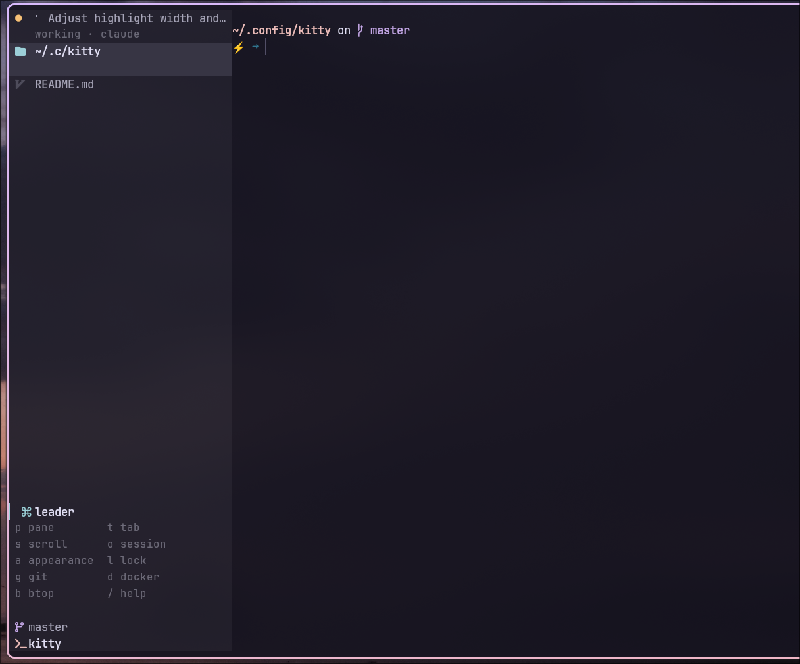

# purrmux

A tmux-ish kitty config — a `ctrl+g` leader driving modal pane/tab/scroll/session navigation, zoxide-backed session management, fzf pane and agent pickers, lazygit/lazydocker overlays, and a custom tab bar that doubles as the mode cheatsheet.




## At a glance

| Tier | Keys | What lives there |
| --- | --- | --- |
| **Leader** | `ctrl+g` | Everything infrequent — modes (`p` pane, `t` tab, `s` scroll, `o` session, `a` appearance, `l` lock) and tools (`g` lazygit, `d` lazydocker, `b` btop, `/` help) |
| **Quick** | `alt+h/j/k/l`, `alt+[`, `alt+]` | The hot path — pane focus and session cycling |
| **kitty** | `ctrl+shift+…` | New tab and window, tab switching |

Three tiers, arranged so kitty takes as little as possible from the programs running inside it: one key from your shell and editor, plus six on the hot path. `ctrl+a` stays beginning-of-line. Full cheatsheet in [`KEYBINDS.md`](KEYBINDS.md), or press `ctrl+g` `/` while running.

In pane mode `h/j/k/l` focus and `H/J/K/L` move — kitty parses a bare `H` identically to `h`, so the two have to be bound as distinct keys or the later one silently wins.

## Contents

- [Prerequisites](#prerequisites)
- [Install](#install)
- [Launch it with `--single-instance`](#launch-it-with---single-instance)
- [Platform support](#platform-support)
- [Customizing without forking](#customizing-without-forking)
- [Vertical tab bar (sidebar)](#vertical-tab-bar-sidebar)
- [Agent attention hooks](#agent-attention-hooks)
- [Security note](#security-note)

## Prerequisites

**Required**

| Tool | Why |
| --- | --- |
| [kitty](https://sw.kovidgoyal.net/kitty/) 0.48+ | The vertical tab bar (`tab_bar_edge left`) is the default here; on older versions see the `override.conf` note under [Vertical tab bar](#vertical-tab-bar-sidebar), which also needs `globinclude` and the `KITTY_OS` variable |
| Python 3 | Ships with both distros; used by the tab bar and the session, tab and tool scripts |
| A [Nerd Font](https://www.nerdfonts.com/) | Tab-bar icons and powerline glyphs. Any of them works; `kitty.conf` names JetBrainsMono |

`kitty.conf` also sets `shell fish`, but nothing here depends on fish — put `shell zsh`, `shell bash` or whatever you use in `override.conf`.

**Used by the keybinds and overlays**

| Tool | Why |
| --- | --- |
| [fzf](https://github.com/junegunn/fzf) 0.58+ | Session picker, pane picker, agent picker and overview. 0.58 is where the `--list-border` / `--input-border` / `--preview-border` options the pickers use landed (tested with 0.74) |
| [zoxide](https://github.com/ajeetdsouza/zoxide) | Source of session candidates |
| [bat](https://github.com/sharkdp/bat) + `less` | Render the `ctrl+g` `/` keybinds tab |

**Optional**

| Tool | Reached by |
| --- | --- |
| [lazygit](https://github.com/jesseduffield/lazygit) | `ctrl+g` `g` |
| [lazydocker](https://github.com/jesseduffield/lazydocker) | `ctrl+g` `d` |
| [btop](https://github.com/aristocratos/btop) | `ctrl+g` `b` |
| `nvim` (or any `$EDITOR`) | Editing session files via the session picker |

## Install

```sh
git clone <this-repo> ~/.config/kitty
~/.config/kitty/setup.sh
```

`setup.sh` seeds `override.conf`, the gitignored file where your own settings go — see [Customizing without forking](#customizing-without-forking). It's safe to rerun: an existing `override.conf` is never overwritten. Skipping it costs you nothing but that starting point, since `globinclude` ignores the file when it's absent.

The `startup_session` and all script paths assume `~/.config/kitty`; if you clone elsewhere you'll need to adjust `kitty.conf` and the `keybinds.conf` launch lines — `setup.sh` warns you when the checkout isn't there.

## Launch it with `--single-instance`

Sessions here are OS windows inside **one** kitty process, and every cross-session feature drives that process through its single remote-control socket (`kitten @ ls`, `focus-window`, …). So launch kitty as:

```sh
kitty --single-instance
```

Put the flag wherever you launch from — a compositor keybind, a `.desktop` file's `Exec=`, or a shell alias. Without it every `kitty` invocation is a separate process with its own socket, and these quietly narrow to "only sees its own window":

- `alt+]` / `alt+[` — session cycling; `cycle-session.py` enumerates the tabs on one socket, so other instances' sessions aren't in the rotation
- `ctrl+g o k` with `--target=window` — the session opens in the instance you invoked it from; separate processes each accumulate their own unrelated set
- `ctrl+g o a` and `ctrl+g o o` — "every agent across all sessions" means every agent in *this* instance
- the quake dropdown's `--main-listen-on auto` — `discover_main_listen_on()` takes the first socket it finds and warns `multiple kitty instances found`; export `KITTY_MAIN_LISTEN_ON` to pin one if you really do run several (or give each pool its own `--instance-group NAME`)

### Making it the default on macOS

macOS can't pass arguments to a GUI app, so kitty reads them from `macos-launch-services-cmdline` next to `kitty.conf` — which this repo ships, containing `--single-instance`. Cloning to `~/.config/kitty` puts it in place; nothing to configure.

That covers every GUI launch (Dock, Spotlight, `open -a kitty`) but not the binary called directly, which takes the flag itself or an alias.

## Platform support

Works on Linux and macOS. OS-specific bits live in `os-linux.conf` and `os-macos.conf`, auto-selected via:

```
include os-${KITTY_OS}.conf
```

Currently split that way:

- **`listen_on`** — Linux uses an abstract unix socket (`unix:@kitty-…`); macOS uses a filesystem socket under `/tmp`.
- **`bell_path`** — Linux points at the freedesktop stereo bell; macOS falls back to kitty's default bell (add your own `bell_path /System/Library/Sounds/Glass.aiff` in `os-macos.conf` if desired).
- **`macos_option_as_alt yes`** (macOS) — the quick tier is Alt-based (`alt+hjkl`, `alt+[` / `alt+]`), and kitty's default `no` makes Option produce Unicode input instead, which would leave those six dead. The trade is Option-composed characters (`é`, `ü`) — put `macos_option_as_alt left` in `override.conf` to keep right-Option for input. The `ctrl+g` leader and everything under it are unaffected either way.
- **`cmd+t` / `cmd+enter`** (macOS) — kitty defines these as plain `new_tab` / `new_window`, skipping the cwd-aware overrides `keybinds.conf` puts on `ctrl+shift+t` / `ctrl+shift+enter`. `os-macos.conf` repoints them at `new_tab_with_cwd` / `new_window_with_cwd` so new tabs and windows join the current session whichever key you reach for.
- **scrollback overlays** — `kitty_mod+i` (nvim pager) and `kitty_mod+m` (scrollback as markdown) live in `os-linux.conf` only. `kitty_mod+i` copies over to `os-macos.conf` as-is; `kitty_mod+m` does not, because `mktemp --suffix=.md` is GNU-only and BSD `mktemp` has no `--suffix`. Use `f=$(mktemp -d)/scrollback.md` there instead — the extension is what makes nvim's markdown rendering fire, so it can't just be dropped.

Everything else in [`KEYBINDS.md`](KEYBINDS.md) is identical across the two: `kitty_mod` is `ctrl+shift` on both platforms, and the `ctrl+g` leader and its in-mode keys are plain characters.

## Customizing without forking

`kitty.conf` ends with:

```
globinclude override.conf
```

`override.conf` sits next to `kitty.conf` and takes any directives you want to change. Because it's included last, it beats everything above it. `setup.sh` creates it for you (with just a comment header pointing back here); you can also write it by hand — the glob matches nothing when the file is absent, so there's no error either way.

It's in `.gitignore`, which is the point: your settings live in the working tree without ever showing up in `git status` or clashing with a `git pull`. Reload after editing with `ctrl+shift+f5` — no restart.

Any `kitty.conf` directive goes in it:

```
# override.conf

# use zsh instead of fish (kitty.conf sets fish)
shell zsh
```

`allow_remote_control no` belongs here too if you want it — read the [Security note](#security-note) first, since it takes the session picker, pane picker, agent overview and tool overlays with it.

## Vertical tab bar (sidebar)

kitty 0.48 can put the tab bar on the left or right edge, and this config uses that by default: `kitty.conf` sets `tab_bar_edge left` with `tab_title_max_length 26` and `tab_bar_align start`. `ctrl+g a v` switches to the horizontal bar and back at runtime — no restart, no config edit:

```sh
tab_bar/toggle-edge.py [toggle|sidebar|horizontal|left|right|top|bottom|hide|show|toggle-hidden|status]
```

Both directions send their own overrides rather than one of them falling back to `kitty.conf`, so the toggle behaves the same whichever edge is configured — the config only decides how kitty starts. Sidebar means `left` + 26 title cells + top-aligned tabs; horizontal means `bottom` + unlimited titles + centred tabs. Adjust either set at the top of `tab_bar/toggle-edge.py`.

`ctrl+g a b` takes the bar away entirely and puts it back at the edge it was on, for when you want the full width for one thing. It's the same reload, so hiding is a state the script carries alongside the edge rather than a separate switch, and asking for an edge (`ctrl+g a v` included) brings a hidden bar back rather than moving one you can't see.

What hides it is `tab_bar_min_tabs`, set absurdly high, rather than the `tab_bar_style hidden` that names the thing. Coming back out of `hidden` takes two reloads to land: kitty relayouts the tabs before it re-reads the style, so the first reload shows the bar without giving the panes their columns back. Too-few-tabs is read in time for that relayout — it's the same route kitty takes when a window has one tab — so both directions take one reload and neither leaves a gap.

Hiding applies to the whole kitty instance, not to one OS window. Every option here comes from the global set that an instance's OS windows share, and kitty has nothing per-window to use instead: filtering a window's tabs away can't stand in for it, because the tabs a bar would show always include the active one. A separate kitty process, such as the quick-access terminal, keeps its own bar.

There is no remote-control command for setting an option, so the script reloads the config with `tab_bar_edge`/`tab_title_max_length`/`tab_bar_align`/`tab_bar_min_tabs` overrides (`kitten @ load-config -o …`), passing all four every time — each call also passes `--ignore-overrides`, so nothing carries over from the last one. Being a config reload, it also resets runtime-only tweaks such as `set_background_opacity` to their configured values. State lives in `$XDG_RUNTIME_DIR/kitty-tab-bar-edge-*`, per kitty instance, falling back to `/tmp` when that variable is unset — which is the normal case on macOS.

The custom tab bar draws a different layout in sidebar mode (`tab_bar/vertical.py`):

- **Tabs** as one flat row each from the top — a coloured dot, the title, and a muted second line. The active tab is a band filled across the whole column rather than a pill, which is what keeps a stack of tabs from reading as a stack of buttons next to a TUI. The dot is the app's icon where we know it, an agent's status dot where the tab is running one, and a folder for a shell, whose title is a path anyway.
- **A second line** under each tab, on the spare row kitty hands out whenever there are at most `lines / 2` tabs: what the agent is doing (`working · claude`), in its status colour. Tabs with no agent leave the row empty, which becomes the space between one tab and the next.
- **A footer** carrying what the horizontal bar keeps in its side sections — the keyboard mode with its hints and any agent waiting on you, then the branch and session. Two groups, split by what they answer: what is happening now, and where you are. It's dropped a row at a time when the tabs need the space, blank rows first, so spacing never costs you a hint.

The divider between sidebar and panes is a change of background rather than a drawn line — it costs no column and can't cut through a highlight, which is why the active band runs the full width. kitty paints the bar in `tab_bar_background` where a theme sets one, and only a quarter of them do, so where a theme doesn't the sidebar derives its own and writes it to the tab bar screen.

There are no section headers between groups of tabs. kitty places each tab at `start_row + i * tab_line_height` and builds the click map from those same rows, so a header row drawn between two tabs would shift every tab below it out of its own hit box and clicking the sidebar would focus the wrong tab.

The branch is the *session's*, read from the directory its session file `cd`s to (`~/.local/share/kitty-sessions/<name>.kitty-session`, cached on that file's mtime) rather than from whatever window is focused. A branch belongs to the project, so it should not change when you cd, and a session whose tabs sit in two different repos should not report whichever one you last looked at. Sessions with no file — the startup session, or one opened by hand — fall back to the focused window's cwd, which is all there is.

### The keyboard mode row

A mode change refreshes the tab bar and nothing else (kitty passes `refresh_active_tab_bar` as its only mode-change callback), so the footer is the one surface that can react to a mode while it's active. A which-key style popup would render fine — kitty's mapping layer takes keys before any window, so an overlay wouldn't steal them — but nothing would ever tell it to close.

So the mode row does both jobs. Idle it shows `^g` rather than the word "normal", which is the only thing advertising the leader; in a mode it shows the mode's name and its keys.

Those keys are drawn from one grouped table in `tab_bar/config.py`, in either of two styles:

```
"labels" (default)        "keys"
 p pane        t tab       modes  p t s o a l
 s scroll      o session    tools  g d b /
 a appearance  l lock
 g git         d docker
 b btop        / help
```

Labels spend five rows on the leader and teach; keys fit it in two and read as a reminder once the letters are familiar. When rows run short the hints are shed from the end, and the last one becomes `…+3 more` rather than disappearing quietly.

To start with the horizontal bar instead, put `tab_bar_edge bottom`, `tab_bar_align center` and `tab_title_max_length 0` in `override.conf` — the same values the toggle sends. That's also the fix on kitty older than 0.48, where `left` is not a valid edge.

## Agent attention hooks

The custom tab bar and `ctrl+g o a` attention picker can show agent windows that need attention.

Install the bundled attention hooks/plugins:

```sh
~/.config/kitty/hooks/install-attention-hooks.sh
```

The installer is safe to rerun. It conditionally installs only what is available on your `PATH`:

- If `claude` exists, it installs `agent-attention-kitty.sh` into `~/.claude/hooks/` and registers it in `~/.claude/settings.json`.
- If `codex` exists, it installs the same script into `${CODEX_HOME:-~/.codex}/hooks/` and registers it in `${CODEX_HOME:-~/.codex}/hooks.json`. Codex reads hooks from `hooks.json` or from `config.toml` and warns when one layer has both, so the installer says so if your `config.toml` already declares any.
- If `opencode` exists, it installs `opencode-attention-kitty.js` into `${XDG_CONFIG_HOME:-~/.config}/opencode/plugins/`.

Claude Code and Codex fire the same hook events, so one script serves both; it takes the agent's name as its second argument and reports it as `agent_name`.

Hook/plugin files and both JSON configs are replaced atomically. Reruns prune the installer's own registrations before adding them back, so changing which events a mode is attached to can't leave two modes firing per event. All three read their hooks at startup, so restart the agent after installing. Codex also gates new hooks behind a trust prompt — it offers *Hooks need review* on its next start, and until you accept it won't run them.

The hooks report state into kitty user vars: `agent_attention` (plus `agent_name`, `agent_attention_source`, `agent_attention_at`) flags a window that wants you while you're looking elsewhere, and `agent_status` carries what the agent is doing — which the sidebar draws on the row under each agent tab, dot coloured from the theme palette:

| status | Claude event | Codex event | OpenCode event | dot |
| --- | --- | --- | --- | --- |
| `working` | `UserPromptSubmit`, `PostToolUse` | `UserPromptSubmit`, `PostToolUse` | `tui.prompt.append`, `tool.execute.before` | yellow |
| `blocked` | `Notification` (permission/idle/elicitation) | `PermissionRequest` | `question.asked`, `permission.asked` | red |
| `done` | `Stop` | `Stop` | `session.idle` | blue |
| `error` | — | — | `session.error` | red |
| `idle` | `SessionStart` | `SessionStart` | — | muted `○` |

`ctrl+g o o` opens the overview — every agent in every session, grouped, with a live preview of that agent's actual screen (`kitten @ get-text`), so you see the real progress rather than a summary of it. It refreshes itself: fzf listens on a loopback port and a ticker in the script posts `reload` to it every couple of seconds, keeping statuses, ages and counts current. Enter focuses the window, `ctrl-x` clears its attention, `ctrl-r` refreshes now. The `for` column is the age of `agent_status_at` — a transition time for one-shot statuses like `blocked`, and a heartbeat while `working`.

`ctrl+g o a` lists the same statuses: every agent window, the ones wanting you first (`!`), then by status — `blocked`, `error`, `waiting`, `done`, `working`, `idle`. `ctrl-x` there drops a window's attention but keeps its status, since the agent is still running. Pass `--attention-only` to get the old attention-just-the-alerts list.

`blocked`, `done` and `error` also raise attention when the window isn't focused. Tabs running an agent that hasn't reported (no hooks installed, or a fresh session) fall back to `waiting` when attention is set and `running` otherwise, based on the process in `AGENT_EXES`.

## Security note

`allow_remote_control yes` with `listen_on` is required by the session/pane/tool scripts (they call `kitten @ ls`, `focus-window`, etc.). The socket is per-user (local-only, not network-exposed), but any process running as your user can drive kitty — running commands and reading pane contents. If that's not acceptable for your threat model, set `allow_remote_control no` in `override.conf` and expect the session picker, pane picker, and lazygit/lazydocker launchers to stop working.
